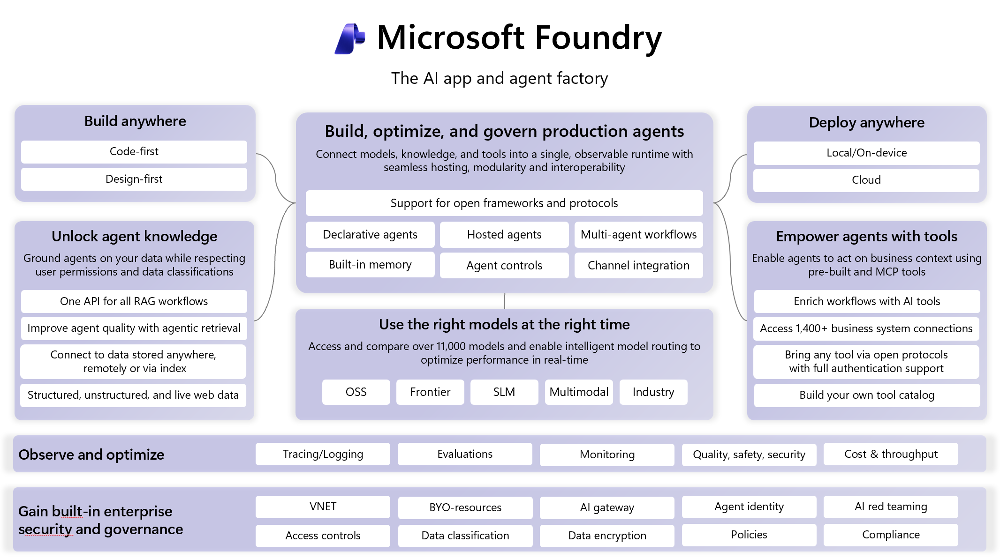

# S1: Foundry Builder Orientation (90 min, no hands-on)

> Duration: 90 min | Format: instructor talk + portal walkthrough | Credentials: none (S1 does not connect to any endpoint)
> Status: ⚠️ Based on Microsoft Foundry 2026/04-05 official docs + portal screenshots; rebrand in progress, instructor re-verifies on Day-7.



## Goal of this segment

Learners are fluent in AI / agents but have **zero knowledge of Microsoft Foundry**—S1 is not a project-design workshop, and you do not fill out your own project decision card.

The 90 minutes do one thing: **let builders see clearly the capability map of a Foundry-native agentic solution**. So that when you go hands-on in S2 you know which platform capability each line of code corresponds to, and after class you know where this pattern can be transplanted.

After S1 you should be able to:

- Say in one sentence "Microsoft Foundry = what"
- In the Foundry portal's 5 top-level sections (Home / Discover / Build / Operate / Docs), point out what each one does
- Explain why a Foundry-native workflow needs the agent, tool / knowledge, eval, guardrail, trace, and governance layers

## 90 min pacing

| Duration | Segment | Content |
|---|---|---|
| 5 min | 1. Opening | What this course gives you / does not teach |
| 2 min | 2. What Foundry is | One-sentence positioning + portal entry |
| 18 min | 3. Discover + Build (portal walkthrough) | Point out the spots S2 will use in the portal |
| 15 min | 4. Operate (Control Plane, Preview) | Cross-project governance, 5 panes |
| 30 min | 5. Foundry-native solution pattern | Foundry-only 3 items + how 3 builder types transplant + 12 readiness boundaries |
| 15 min | 6. Q&A + environment check + scenario self-read | — |
| 5 min | Buffer | Instructor discretion |

## 1. Opening (5 min)

### 1.1 What this course gives you (2 min)

- See clearly the current capability map of Microsoft Foundry 2026
- Run a prompt agent end to end (Responses API + agent_reference)
- Run one evaluation with a built-in evaluator
- See once how Control Plane manages a guardrail policy
- Take away a transplantable Customer Operations Agent pattern
- Know that the course has two layers: in class you run through the agent → eval → guardrail → trace pattern; enterprise readiness is only flagged, not exercised item-by-item—full list is in [Enterprise Readiness](../enterprise-readiness.md)

### 1.2 What this course does not teach (1.5 min)

- ❌ Per-team project design / architecture review
- ❌ Bicep / azd / IaC deployment
- ❌ Hands-on with Hosted / Workflow agents (preview)
- ❌ Hands-on multi-agent orchestration
- ❌ 5-dimension scoring process

### 1.3 Learner conventions (1.5 min)

- S1: no hands-on, no endpoint connections
- S2 uses environment variables; environment self-check at the end of S1
- Interrupt anytime, don't save questions for Q&A

## 2. What Foundry is (2 min)

> Source: [What is Microsoft Foundry?](https://learn.microsoft.com/en-us/azure/foundry/what-is-foundry) (2026/04/29)

Microsoft Foundry = a **unified AI platform** on Azure—one place to build model + agent + knowledge base + governance.

Portal entry: `https://ai.azure.com` (toggle **New Foundry** at the top).

This is the platform you'll use in S2. Hands-on 0 in S2 will teach package install + the first line of code; S1 does not pre-warm.

## 3. Discover + Build: what you can use + what to build inside a project (18 min, portal walkthrough)

> Source: [Navigate the Foundry portal](https://learn.microsoft.com/en-us/azure/foundry/how-to/navigate-from-classic#navigate-the-portal) (2026/03) + instructor portal screenshots
>
> Pacing: **only point out locations in the portal, do not go into concept detail**. The three agent types, evaluator categories, and the relationship between the two guardrail layers will be re-explained during S2 hands-on; S1 does not pre-teach them.

### 3.0 Locate the 5 top-level portal sections (1 min)

Instructor screen-shares `https://ai.azure.com` and points to the 5 sections in the top right:

| Section | Scope | What it does |
|---|---|---|
| **Home** | Current project | Project overview + quick actions |
| **Discover** | Current project | Browse / select (see what you can use) |
| **Build** | Current project | Actually build (agent / model deployment / eval / guardrail) |
| **Operate** | **Cross-project** | Governance (see §4) |
| **Docs** | — | Documentation links |

§3 covers **Discover + Build**; §4 covers **Operate**. Explore Home / Docs on your own.

### 3.1 Discover: what you can use (5 min)

5 items in the left rail (screenshots from live portal):

| Sub-node | What it is | Builder focus |
|---|---|---|
| **Overview** | Today's portal-featured models at a glance (the model catalog and preview capabilities drift) | First thing you see in Foundry |
| **Models** | Full catalog of 1,900+ models | Model is not vendor-locked; automatic Tier upgrades |
| **Agents** | Agent template gallery (see how others built them) | Before S2 hands-on 0, you can grab a starter here |
| **Tools** | Browse the tool catalog (**1,400+ tools** via public + private catalog; the older agent docs line "12 built-in + 4 custom + Toolbox preview" is the agent built-in subset) | Look here before deciding what tool to wire in |
| **Solution templates** | Scenario-based solution templates | Out-of-box scenarios: customer ops / enterprise knowledge / data analysis |

**Honorable mentions** (builders should know they exist): Model Router (preview, auto-select model) / Priority processing (preview, reserved throughput) / Fireworks model import (preview, third-party inference provider).

### 3.2 Build: build inside the current project (12 min)

8 items in the left rail (screenshots from live portal). **Goal: when learners open the portal in S2 they know where each sub-node is and what it's for**—no concept teaching.

| Sub-node | What to point at in the portal | Which v3 segment re-covers it |
|---|---|---|
| **Agents** | "S2 hands-on 0 creates the agent here; trace is in the top Traces tab; Workflows is marked Preview" | S2 hands-on 0 explains the three agent types |
| **Models** | "Deployment management + playground are here" | — |
| **Fine-tune** | "v3 doesn't touch this, just know where it is" | — |
| **Tools** | "Project-internal tool config entry" | After-class extension |
| **Knowledge** | "**Portal entry for Foundry IQ is here**" | §5 5.1.1 deep dive |
| **Data** | "S2 hands-on 1 uploads the eval dataset here" | S2 hands-on 1 |
| **Evaluations** | "S2 hands-on 1 sees report_url + per-evaluator reasoning here" | S2 hands-on 1 explains the three evaluator categories |
| **Guardrails** | "S2 hands-on 2 sees the project-level guardrail entry here; in class the main change is to agent instructions; this is not the same thing as Operate → Compliance, see §4" | S2 hands-on 2 + §4 |

**Instructor portal walkthrough flow**:
- Open each sub-node for ~1.5 min, read one line from the "What to point at in the portal" column
- ⚠️ If Day-7 portal UI has changed, use what's on screen

## 4. Operate: cross-project governance (15 min)

> Source: [Foundry Control Plane](https://learn.microsoft.com/en-us/azure/foundry/control-plane/overview) (2026/05/06) + portal screenshots

### 4.0 Positioning, 30 s

- Switching from Build (build) to Operate (manage)
- ⚠️ Operate overall is currently **Preview** (Preview tag next to portal Overview)
- Key distinction: Operate is **cross-project + cross-subscription**—Discover / Build are scoped to the current project

### 4.1 5 left-rail sub-nodes (8 min)

| Pane | What it does | Builder view |
|---|---|---|
| **Overview** | Cross-project + cross-subscription: Running agents / Estimated cost / Agent success rate / 7D / 1M view | Once you have 5 agents in production, this is your home page |
| **Assets** | Cross-project inventory of all agents / models / tools | "Who costs most, who's on the oldest version"—at a glance; **Continuous evaluation is configured here** |
| **Compliance** | **4 tabs**: Policies / Guardrails / Security posture / Data security and governance | **S2 hands-on 2 platform layer** walks the Policies tab |
| **Quota** | Model deployment quota view; Show all toggle to see available quota for unmounted models | Look here before picking region / model |
| **Admin** | Project / user / connected resource governance across subscriptions | IT admin use, not daily |

### 4.2 Live portal demo of Compliance (5 min)

The instructor opens Operate → Compliance (**learners do not create individually**—RBAC isn't sufficient) and walks each tab:

| Compliance tab | What it does |
|---|---|
| **Policies** | The **Create policy** button is here → choose controls (content safety / prompt injection / protected materials) + scope (subscription / RG) + exceptions; Azure Policy runs in the background |
| **Guardrails** | Cross-project guardrail status view—see whether the fleet has guardrails configured consistently |
| **Security posture** | Security posture assessment (v3 does not expand) |
| **Data security and governance** | Purview / DLP integration view (v3 does not expand) |

### 4.3 Discussion (1.5 min)

In your product / customer solution / platform tooling, what is the equivalent of this Operate layer?
Usually you build your own dashboards, permission governance, cost scripts, and policy process; that's the problem Foundry Control Plane is trying to solve.

## 5. Foundry-native solution pattern (30 min)

> From the builder view, explain "why a deliverable agentic solution is not just a prompt demo." Not per-team project design—just a judgment framework for transplanting this pattern after class.

### 5.1 Foundry-only 3 items (10 min)

**5.1.1 Foundry IQ** (3.5 min)
- What it is: enterprise knowledge layer = knowledge base + agentic retrieval + ACL/Purview
- Portal entry: **Build → Knowledge**
- Without the platform: you maintain your own retrieval, citations, permission filtering, and data governance
- Gap if pieced together: ACL/Purview integration takes weeks; agentic retrieval (multi-step query rewrite) you tune yourself
- Builder focus: the "serious" way to build a customer-service FAQ knowledge base

**5.1.2 Foundry Control Plane (Operate)** (3.5 min)
- What it is: cross-subscription fleet governance + Compliance policy + Quota + Cost
- Without the platform: you maintain your own dashboard, cost scripts, policy config, and asset inventory
- Gap if pieced together: takes months; the cross-subscription / cross-platform layer basically can't be pieced together
- Builder focus: once you have 5 agents in production, this is your home page

**5.1.3 Built-in evaluators + Continuous evaluation** (3 min)
- What it is: out-of-box evaluators (task_adherence / coherence / violence / a dozen-plus) + configure continuous evaluation in Operate → Assets
- Without the platform: you maintain your own eval harness, reports, CI gate, and in-production sampling evaluation
- Gap if pieced together: evaluation is feasible, but doesn't plug into the Azure governance system; continuous evaluation you build yourself
- Builder focus: S2 hands-on 1 uses exactly this

### 5.2 How 3 builder types transplant this pattern (15 min)

**5.2.1 Product startup** (5 min)
- Swap the classroom "order lookup" for an in-product support / research / workflow assistant
- Keep: agent version, eval gate, business guardrail, trace
- First step after class: pick 1 high-frequency workflow, write 3 happy / edge / adversarial evals

**5.2.2 Solution partner** (5 min)
- Swap the classroom sample for deliverable solutions in customer ops, field service, sales ops, compliance review, etc.
- Keep: mock-first, tool boundaries, hand-off-to-human rules, runbook
- First step after class: split customer business actions into query / recommend / mutate; mutate defaults to human confirmation

**5.2.3 Platform / infra builder** (5 min)
- Swap the classroom sample for eval gate, tool gateway, agent registry, observability workflow
- Keep: Foundry project endpoint, Control Plane, asset visibility, continuous evaluation
- First step after class: build a minimal adapter for one platform capability, rather than rebuilding the whole agent runtime

### 5.3 Open Q (5 min)

- Builders describe their product / customer / platform direction; the instructor only maps it to one of the three transplant paths
- Be ready to catch "is my scenario necessarily a fit for Foundry"—the answer may be no; this session only gives the judgment basis, it does not finish the design for you

## 6. Q&A + environment check + scenario self-read (15 min)

### 6.1 Environment self-check (5 min, all learners run live)

```bash
az account show
python -c "import azure.ai.projects; print(azure.ai.projects.__version__)"
echo $PROJECT_ENDPOINT
codex --version
```
- The instructor collects "stuck" cases in the group chat
- Anything that can't be resolved in 5 min pairs up for S2

### 6.2 Scenario self-read (5 min)

- Learners read [scenario.md](../scenario.md) themselves
- Customer Operations Agent business background + 5 user stories
- The instructor does not read it aloud

### 6.3 Q&A (5 min)

- Remaining time collects overall S1 questions
- Anything that can't be answered gets pushed to S2 breaks or after class

## After-class extensions (what S1 didn't fully cover)

Not expanded in S1, but builders should read after class:

- [Enterprise Readiness](../enterprise-readiness.md)—12 categories of go-live boundary: identity, network, data, deployment, quota, security, tool, eval, logging, DR, cost, operational responsibility
- [What is Foundry Agent Service?](https://learn.microsoft.com/en-us/azure/foundry/agents/overview)—detailed comparison of the three agent types
- [Tool catalog](https://learn.microsoft.com/en-us/azure/foundry/agents/concepts/tool-catalog)—1,400+ tools (public + private catalog) + agent built-in 12+4 subset + Toolbox
- [What is Foundry IQ?](https://learn.microsoft.com/en-us/azure/foundry/agents/concepts/what-is-foundry-iq)—the "serious" way to do an enterprise knowledge layer
- [Agent tracing](https://learn.microsoft.com/en-us/azure/foundry/observability/concepts/trace-agent-concept)—OTel semantic conventions + multi-agent tracing
- [Agent evaluators](https://learn.microsoft.com/en-us/azure/foundry/concepts/evaluation-evaluators/agent-evaluators)—task_adherence / intent_resolution / tool_call_success, etc.
- [Navigate the Foundry portal](https://learn.microsoft.com/en-us/azure/foundry/how-to/navigate-from-classic)—the full portal navigation map
- [What's new in Microsoft Foundry](https://learn.microsoft.com/en-us/azure/foundry/whats-new-foundry)—follow monthly updates here
- v2 3-day full 11 modules: `docs/00-training-plan-v2.md`—⚠️ v2 content is still based on the Foundry classic line, partially outdated in H1 2026, awaiting instructor upgrade
